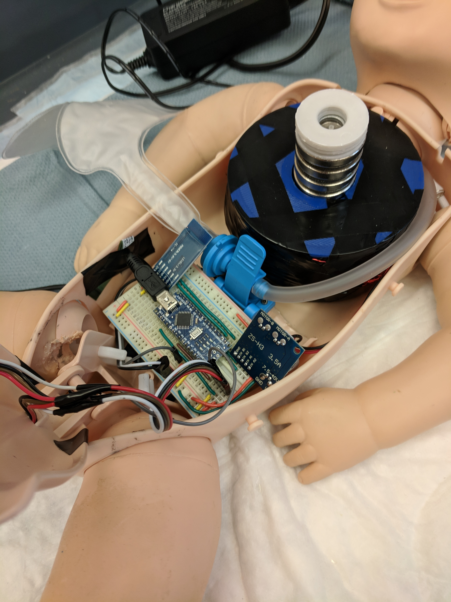

# MoldingManikin
Arduino code for a prototype CPR training manikin that simulates dampening on recoil to make compressions feel more realistic. Uses a solenoid coil wrapped around the manikin spring (shown in picture below) to adjust the spring force throughout the recoil. A motor driver controls the voltage (using PWM) through the coil to adjust magnetic force. See [here](/Molding_Manikin_Demo/Molding_Manikin_Demo_Video.mp4) for a video demo. You can see the chest recoil looks more like a nerf ball reinflating than a spring shooting back up.

## Mechanical Setup
Uses an accelerometer at the base of the chest plate (shown below) along with a series of kalman filters (for smoothing) to estimate depth.

## Code

